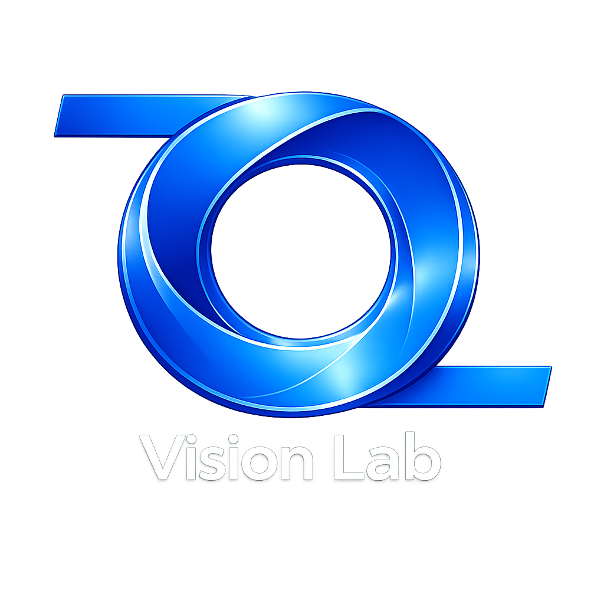
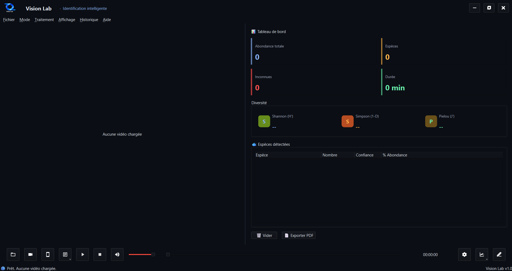

<p align="center">
  
</p>

<h1 align="center">🐟 Vision Lab</h1>

<p align="center">
  <strong>Application de recherche appliquée pour la biodiversité marine et l’environnement</strong>
</p>

<p align="center">
  <a href="#"></a>
  <a href="#"></a>
  <a href="#"></a>
  <a href="#"></a>
  <a href="#"></a>
</p>

---

**Vision Lab** est une application de bureau puissante conçue pour les scientifiques marins, les écologistes et les plongeurs. Elle automatise l'analyse des vidéos sous‑marines en détectant, suivant et classifiant **28 espèces de poissons de récif** ainsi que **5 types de déchets marins** grâce à des modèles d’intelligence artificielle de pointe.

---

## 📸 Aperçu & Démonstration

<!-- 
  INSTRUCTIONS POUR LA VIDÉO : 
  1. Allez dans l'onglet "Issues" de ce dépôt.
  2. Créez une nouvelle Issue et glissez-déposez votre vidéo (MP4) dans le champ de texte.
  3. GitHub générera un lien du type : https://github.com/user-attachments/assets/XXXXX
  4. Copiez ce lien et remplacez "LIEN_VIDEO_ISSUE" ci-dessous.
  5. Fermez l'issue sans l'envoyer si vous le souhaitez.
-->

| Interface principale |
|:---:|
|  | 

### 🎥 Démonstration vidéo
[](https://github.com/user-attachments/assets/LIEN_VIDEO_ISSUE)  
*Cliquez sur l'image pour visionner la démonstration (lecteur intégré GitHub).*

---

## ✨ Fonctionnalités principales

| Domaine | Fonctionnalités |
| :--- | :--- |
| **🤖 Intelligence Artificielle** | Détection d’objets (YOLOv8n), suivi multi‑objets (BoT‑SORT), classification deep learning (DINOv2 + ONNX), détection d’anomalies (Isolation Forest). |
| **📊 Analyse scientifique** | Statistiques écologiques en direct : abondance, richesse spécifique, indices de **Shannon**, **Simpson** et **Pielou**. |
| **📹 Sources vidéo** | Compatible avec les fichiers vidéo, webcams, GoPro, caméras IP, et flux smartphone (serveur HTTP intégré + QR code). |
| **📑 Rapports & Export** | Génération de rapports scientifiques au format **PDF** avec logo, tableaux de données et grille adaptative des meilleures images par espèce. |
| **✏️ Interface & Correction** | Interface fluide (PySide6, thème sombre), correction manuelle des prédictions, ajout de classes personnalisées, sauvegarde automatique des images classifiées. |
| **⚙️ Paramètres avancés** | Choix du GPU/CPU, intervalle d’inférence, seuils de confiance, modes de sauvegarde (meilleure image ou toutes les images). |

---

## 🚀 Installation

### Option 1 – Installateur Windows (Recommandé)
1. Téléchargez l’installateur `VisionLab_Setup_v1.0.exe` depuis la **[section Releases](https://github.com/votre-username/vision-lab/releases)**.
2. Exécutez‑le et suivez les instructions à l’écran.
3. L’application s’installe dans `C:\Program Files\Vision Lab`.
4. Des raccourcis sont automatiquement créés sur le **Bureau** et dans le **menu Démarrer**.

### Option 2 – Exécution depuis les sources (Développeurs)
```bash
# 1. Cloner le dépôt
git clone https://github.com/soirfaneabdallah/Vision-Lab.git
cd Vision-Lab

# 2. Créer un environnement virtuel
python -m venv venv
venv\Scripts\activate

# 3. Installer les dépendances
pip install -r requirements.txt

# 4. Lancer l'application
python -m fishid.main_window